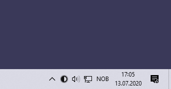
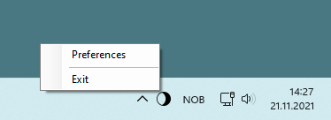
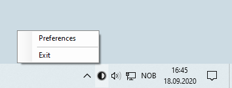

# Light Switch

## Description

Easily switch between light and dark theme in Windows 10 and 11.

This application displays an icon in your system tray, which you can click to change Windows theme.

## Download

Go to the [Releases](https://github.com/wireless-r/Light-Switch/releases) page to download the installer.

## How to use

Click the icon once to switch from light to dark, or from dark to light.

Right-click the icon to open the menu.

Set your preferences.

## Release notes

- Version 2.2:
  - New icon and new logo.
  - Code refactoring.
  - Some of your Preferences may become reset if you choose to install this version.