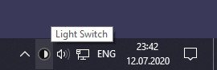

# Light Switch

## Description

A tray icon which you can click to switch between light and dark mode in Windows 10.

## Download

Go to the [Releases](https://github.com/wireless-r/Light-Switch/releases) page to download the installer.

## How to use

Click the tray icon once to switch from light to dark, or from dark to light.

## Credits

Thanks to [Armin2208/Windows-Auto-Night-Mode](https://github.com/Armin2208/Windows-Auto-Night-Mode) for registry keys.